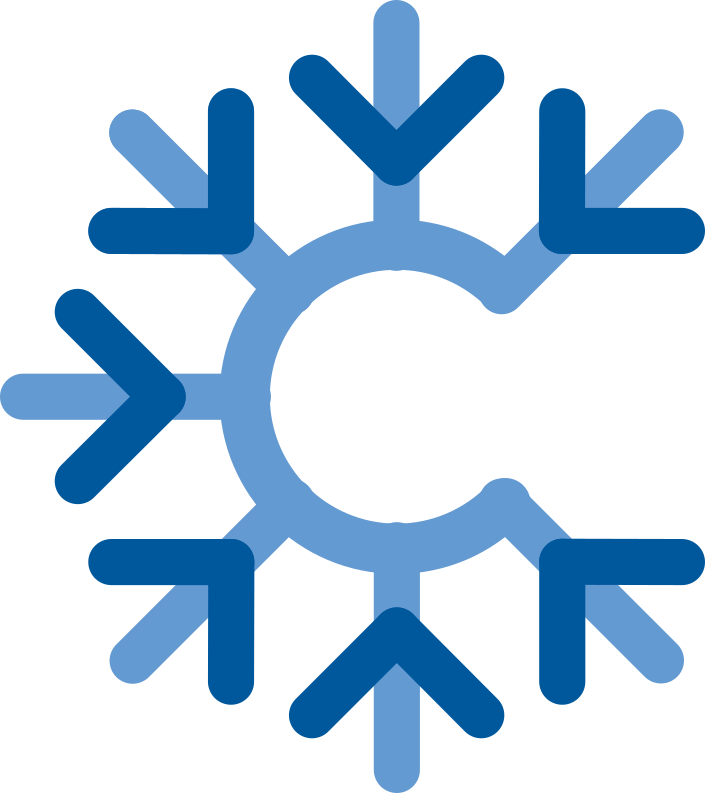

# ice_libs

<div align="center">
  <br><br>
  <p>Collection of Cross-Platform Single-Header C libraries for doing a lot of stuff! (Still WIP)</p>
</div>
<br>

### Brief

ice_libs is collection of Single-Header C libraries, Designed to introduce stuff that sokol and some single-header libs didn't offered, In addition to more stuff offered by these libs.

Since months, I (Rabia) was working on something called "fegame", Universal game framework that uses [rxi](https://github.com/rxi)'s [fe](https://github.com/rxi/fe) as scripting language that can run on all platforms as possible...

However things didn't came with success and stuck with a lot of things so i decided to make `ice_libs` which you see right now, But in same time this born as standalone project away of "fegame" which stopped to work on this amazing thing! :)

Oh and also, Come join us at discord from [here!](https://discord.gg/DruPBE5m2C)

### Goals

1. Portability: ice libraries always trying to use ANSI C when possible, Except if in need to use C++ (Haiku, BeOS, UWP) or Objective-C (Apple).
2. Cross-Platform: One of goals ice libraries provide is to be implemented on every platform if possible, Including Game Consoles.
3. Customizable: ice libraries offers ability to use call conventions, Custom memory allocators, And a lot of things that makes it possible to use and build the libraries on every platform supported by ice libraries.
4. Platform-Detectable: ice libraries can detect platform that program runs on, So you are not forced to define implementation platform and backend used.
5. Bindings-Friendly: Designed to make bindings much easier!
6. Easy to code.
7. Optimizable.
8. Easy to license: ice libraries allows you to choose between 2 licenses: Public Domain and MIT!

### Libraries

| library                                                                               | library description                                              | platforms supported                                                                                                                                     | languages     | lines of code |
|---------------------------------------------------------------------------------------|------------------------------------------------------------------|---------------------------------------------------------------------------------------------------------------------------------------------------------|---------------|---------------|
| [ice_ffi.h](https://github.com/Rabios/ice_libs/raw/master/ice_ffi.h)                  | Cross-Platform Single-Header library to work with shared libs    | Microsoft platforms, Unix, Unix-like                                                                                                                    | C             | 309           |
| [ice_fs.h](https://github.com/Rabios/ice_libs/raw/master/ice_fs.h)                    | Cross-Platform Single-Header library for filesystem functions    | Anywhere                                                                                                                                                | C             | 1898          |
| [ice_clipboard.h](https://github.com/Rabios/ice_libs/raw/master/ice_clipboard.h)      | Cross-Platform Single-Header Clipboard library                   | Anywhere                                                                                                                                                | C, C++, Obj-C | 716           |
| [ice_ram.h](https://github.com/Rabios/ice_libs/raw/master/ice_ram.h)                  | Cross-Platform Single-Header library to get RAM info             | Microsoft platforms, Unix, Unix-like, Web, PSP                                                                                                          | C             | 394           |
| [ice_time.h](https://github.com/Rabios/ice_libs/raw/master/ice_time.h)                | Cross-Platform Single-Header Time library                        | Anywhere                                                                                                                                                | C             | 927           |
| [ice_easings.h](https://github.com/Rabios/ice_libs/raw/master/ice_easings.h)          | Cross-Platform Single-Header Easings library                     | Anywhere                                                                                                                                                | C             | 454           |
| [ice_math.h](https://github.com/Rabios/ice_libs/raw/master/ice_math.h)                | Cross-Platform Single-Header Math library                        | Anywhere                                                                                                                                                | C             | 3619          |
| [ice_al.h](https://github.com/Rabios/ice_libs/raw/master/ice_al.h)                    | Cross-Platform Single-Header OpenAL API loader                   | OpenAL API supported platforms                                                                                                                          | C             | 670           |
| [ice_steam.h](https://github.com/Rabios/ice_libs/raw/master/ice_steam.h)              | Cross-Platform Single-Header Steamworks API loader               | Steamworks API supported platforms                                                                                                                      | C             | 4776          |
| [ice_test.h](https://github.com/Rabios/ice_libs/raw/master/ice_test.h)                | Cross-Platform Single-Header Tiny unit testing lib               | Anywhere                                                                                                                                                | C             | 165           |
| [ice_str.h](https://github.com/Rabios/ice_libs/raw/master/ice_str.h)                  | Cross-Platform Single-Header for working with strings            | Anywhere                                                                                                                                                | C             | 652           |
| [ice_arr.h](https://github.com/Rabios/ice_libs/raw/master/ice_arr.h)                  | Cross-Platform Single-Header for working with numeric arrays     | Anywhere                                                                                                                                                | C             | 783           |
| [ice_battery.h](https://github.com/Rabios/ice_libs/raw/master/ice_battery.h)          | Cross-Platform Single-Header for getting battery info            | Microsoft platforms, Unix, Unix-like, Web, Nintendo Switch, PSP, PSVita                                                                                 | C             | 1006          |
| [ice_cpu.h](https://github.com/Rabios/ice_libs/raw/master/ice_cpu.h)                  | Cross-Platform Single-Header for getting basic CPU info          | Microsoft platforms, Unix, Unix-like, Web, Nintendo Switch, PSP, PSVita, PS1, PS2, PS3, PS4, PS5, NDS, 3DS, HP-UX, IRIX, GameCube, Wii, WiiU, GBA       | C             | 729           |
| [ice_joy.h](https://github.com/Rabios/ice_libs/raw/master/ice_joy.h)                  | Cross-Platform Single-Header for Joystick input                  | Microsoft platforms, Unix-like (No old BSD support), Web, Nintendo Switch, PSP, PSVita, PS1, PS2, PS3, PS4, NDS, 3DS, GameCube, Wii, WiiU, Haiku, BeOS              | C, C++, Obj-C | 4497          |

> More libs incoming, Get prepared for!

> NOTE: Unix and Unix-like platforms means Linux, iOS, OSX, Haiku, BeOS, and Android.

> For docs of ice_libs see [here!](https://github.com/Rabios/ice_libs/blob/master/docs/README.md)

### License

All libraries in ice_libs are "Dual-Licensed" (MIT and Public Domain), Choose the one you prefer!

```
------------------------------------------------------------------------
LICENSE A - PUBLIC DOMAIN LICENSE
------------------------------------------------------------------------
This is free and unencumbered software released into the public domain.
Anyone is free to copy, modify, publish, use, compile, sell, or
distribute this software, either in source code form or as a compiled
binary, for any purpose, commercial or non-commercial, and by any
means.

In jurisdictions that recognize copyright laws, the author or authors
of this software dedicate any and all copyright interest in the
software to the public domain. We make this dedication for the benefit
of the public at large and to the detriment of our heirs and
successors. We intend this dedication to be an overt act of
relinquishment in perpetuity of all present and future rights to this
software under copyright law.

THE SOFTWARE IS PROVIDED "AS IS", WITHOUT WARRANTY OF ANY KIND,
EXPRESS OR IMPLIED, INCLUDING BUT NOT LIMITED TO THE WARRANTIES OF
MERCHANTABILITY, FITNESS FOR A PARTICULAR PURPOSE AND NONINFRINGEMENT.
IN NO EVENT SHALL THE AUTHORS BE LIABLE FOR ANY CLAIM, DAMAGES OR
OTHER LIABILITY, WHETHER IN AN ACTION OF CONTRACT, TORT OR OTHERWISE,
ARISING FROM, OUT OF OR IN CONNECTION WITH THE SOFTWARE OR THE USE OR
OTHER DEALINGS IN THE SOFTWARE.

For more information, please refer to <http://unlicense.org/>
```

```
------------------------------------------------------------------------
LICENSE B - MIT LICENSE
------------------------------------------------------------------------
Copyright (c) 2021 - 2022 Rabia Alhaffar

Permission is hereby granted, free of charge, to any person obtaining a copy
of this software and associated documentation files (the "Software"), to deal
in the Software without restriction, including without limitation the rights
to use, copy, modify, merge, publish, distribute, sublicense, and/or sell
copies of the Software, and to permit persons to whom the Software is
furnished to do so, subject to the following conditions:
The above copyright notice and this permission notice shall be included in
all copies or substantial portions of the Software.

THE SOFTWARE IS PROVIDED "AS IS", WITHOUT WARRANTY OF ANY KIND, EXPRESS OR
IMPLIED, INCLUDING BUT NOT LIMITED TO THE WARRANTIES OF MERCHANTABILITY,
FITNESS FOR A PARTICULAR PURPOSE AND NONINFRINGEMENT.  IN NO EVENT SHALL THE
AUTHORS OR COPYRIGHT HOLDERS BE LIABLE FOR ANY CLAIM, DAMAGES OR OTHER
LIABILITY, WHETHER IN AN ACTION OF CONTRACT, TORT OR OTHERWISE, ARISING FROM,
OUT OF OR IN CONNECTION WITH THE SOFTWARE OR THE USE OR OTHER DEALINGS IN
THE SOFTWARE.
```

### Special Thanks

1. [r-lyeh](https://github.com/r-lyeh), [Eduardo Bart](https://github.com/edubart), [André L. Alvares](https://github.com/Andre-LA), and [Nicolas Sauzede](https://github.com/nsauzede) for encouraging me to work on this!
2. [Together C and C++ Discord Server](https://discord.gg/99A4kq4a) community, They are very amazing and helped me when got stuck.
3. [Sean Barrett](https://github.com/nothings), [Dominik Madarász](https://github.com/zaklaus), [Andre Weissflog](https://github.com/floooh), and [Micha Mettke](https://github.com/vurtun) as i got inspiration from their libs to work on my own!
4. [younlok](https://github.com/younlok) for logos.
5. Also it worth mentioning [Amir Rajan](https://github.com/amirrajan) and [Ramon Santamaria](https://github.com/raysan5) for their help!
6. Everyone including you!
